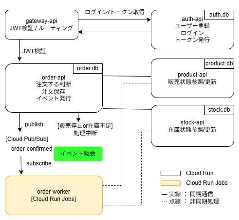
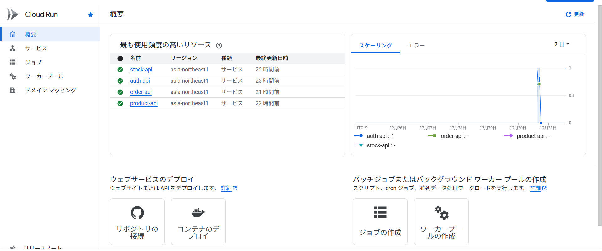
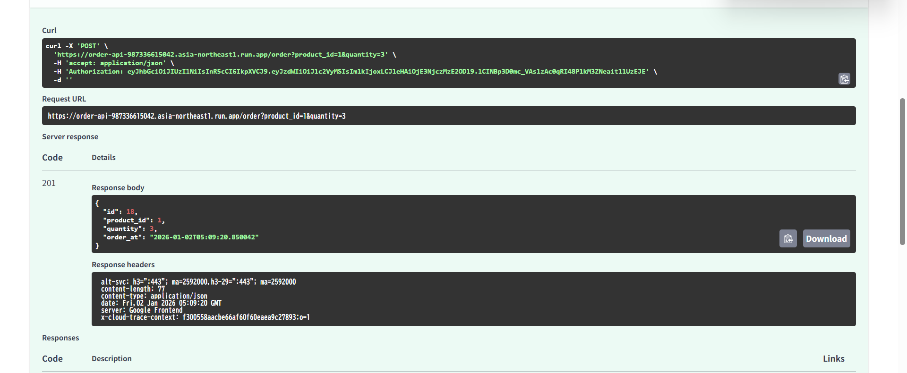
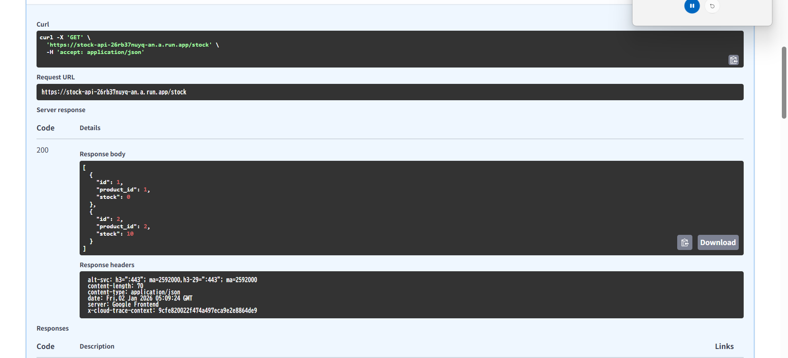
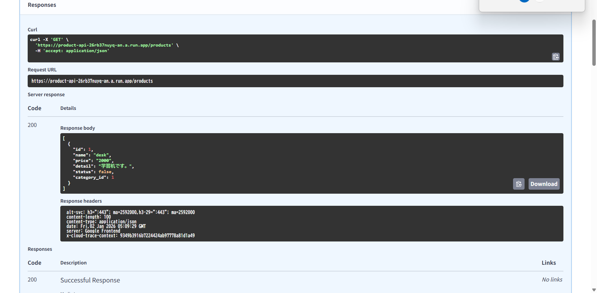

# 注文システム　マイクロサービス

FastAPIを使用したEcサイトの注文システムのマイクロサービス実装例です。\
各サービスは独立しており、サービス間通信にはREST APIを使用しています。
注文確定時にイベントを発生させ、後続の処理をする仕組みをいれました。

## 目的

- マイクロサービスアーキテクチャの理解と実装
- サービス間通信（REST API）の実装
- イベント駆動での連携理解と実装
- 同期非同期通信の理解
- メッセージキューの導入

## アーキテクチャ

### ローカル開発環境（Redis使用）


### GCP本番環境（Cloud Pub/Sub使用）



## 技術スタック

FastAPI\
SQLAlchemy（ORM）\
Alembic（マイグレーション）\
SQLite\
Pydantic（バリデーション）\
python-jose（JWT 認証）\
redis（メッセージキュー）\

## ファイル構成

```python
ec-microservice/
├── auth-api/          # 認証サービス
├── product-api/       # 商品管理サービス
├── stock-api/         # 在庫管理サービス
├── order-api/         # 注文サービス
├── requirements.txt   # 共通依存パッケージ
└── README.md          # このファイル
```

## 各サービスの役割

### Auth API（認証サービス）

ポート: 8000
データベース: user.db

- ユーザー登録（サインアップ）
- ログイン認証
- JWT トークン発行・検証

### Product API（商品管理サービス）

ポート: 8001
データベース: product.db

- 商品のCRUD操作
- カテゴリと商品の関連管理（外部キー制約）
- 商品IDによる商品検索

## Stock API（在庫管理サービス）

ポート: 8002
データベース: stock.db

- 商品ごとの在庫数管理
- 在庫の照会・更新・削除
- 商品IDによる在庫検索

## Order API（注文サービス）

ポート: 8003
データベース: order.db

- 注文処理（他サービスと連携）
- 商品在庫確認 → 在庫減算 → 注文記録
- JWT認証による注文者識別

サービス間連携フロー:

1. JWT トークンから user_id を取得
2. Product API で商品存在確認
3. Stock API で在庫数確認
4. 注文をデータベースに記録
5. 注文確定イベントを発生させ、以下の処理を行う
　・stock.db在庫を減少
　・在庫数が0ならば、product.dbのstatusをfalseに変更

エラーハンドリング:

商品が存在しない → ProductNotFoundError\
商品が販売中止　→ ProductDiscontinuedError\
在庫不足 → InsufficientStockError

## GCPデプロイ（本番環境）

### デプロイ済みサービス（動作確認のみ）

- auth-api: Cloud Run (JWT認証)
- product-api: Cloud Run (商品管理)
- stock-api: Cloud Run (在庫管理)
- order-api: Cloud Run (注文処理)
- order-worker: Cloud Run Jobs (イベント購読)
- メッセージキュー: Cloud Pub/Sub

#### Cloud Runコンソール画面



4つのサービスが正常にデプロイされている状態。

#### 動作確認





注文処理により在庫が減少し、在庫ゼロで自動的に販売中止となることを確認。

### デプロイ手順

#### 1. 前提条件

- Google Cloud CLIインストール済み
- GCPプロジェクト作成済み
- 課金アカウント設定済み

#### 2. 認証とプロジェクト設定

```bash
gcloud auth login
gcloud config set project [PROJECT_ID]
gcloud services enable run.googleapis.com
gcloud services enable artifactregistry.googleapis.com
gcloud services enable pubsub.googleapis.com
```

#### 3. Pub/Subセットアップ

```bash
gcloud pubsub topics create order-confirmed
gcloud pubsub subscriptions create order-confirmed-sub --topic=order-confirmed
```

#### 4. 各サービスのデプロイ

```bash
# デプロイ用ブランチに切り替え
git checkout feature/add-gcp-deployment

```bash
# Auth API
cd auth-api
gcloud run deploy auth-api --source . --region asia-northeast1 --allow-unauthenticated

# Product API
cd ../product-api
gcloud run deploy product-api --source . --region asia-northeast1 --allow-unauthenticated

# Stock API
cd ../stock-api
gcloud run deploy stock-api --source . --region asia-northeast1 --allow-unauthenticated

# Order API
cd ../order-api
gcloud run deploy order-api --source . --region asia-northeast1 --allow-unauthenticated
```

#### 5. order-workerのデプロイ

```bash
cd order_worker
gcloud builds submit --tag gcr.io/[PROJECT_ID]/order-worker
gcloud run jobs create order-worker --image gcr.io/[PROJECT_ID]/order-worker --region asia-northeast1 --execute-now
```

### GCP環境（デプロイ後）

デプロイ後のURLは`gcloud run services list`で確認できます。
各URLに`/docs`を付けてアクセスしてください。

例: `https://auth-api-[PROJECT_ID].asia-northeast1.run.app/docs`

## セットアップ(ローカル開発環境)

### 1. 依存パッケージのインストール

```bash
pip install -r ../requirements.txt

```

### 2. Redisの起動

```bash
# Dockerを使用
docker run -d -p 6379:6379 --name redis redis:latest

# 起動確認
docker ps
```

### 3. 各サービスのデータベースセットアップ

```bash
# Auth API
cd auth-api
alembic upgrade head

# Product API
cd ../product-api
alembic upgrade head

# Stock API
cd ../stock-api
alembic upgrade head

# Order API
cd ../order-api
alembic upgrade head
```

### 実行方法

各サービスを別々のターミナルで起動してください。

```bash
# ターミナル1: Auth API
cd auth-api
python main.py
# → http://localhost:8004

# ターミナル2: Product API
cd product-api
python main.py
# → http://localhost:8001

# ターミナル3: Stock API
cd stock-api
python main.py
# → http://localhost:8002

# ターミナル4: Order API
cd order-api
python main.py
# → http://localhost:8003

# ターミナル5: イベント購読（order-worker）
cd order_worker
python event_listener.py
# → イベント購読開始
```

各サービスは自動生成されるSwagger UIでAPIを確認できます。

- Auth API: <http://localhost:8000/docs>
- Product API: <http://localhost:8001/docs>
- Stock API: <http://localhost:8002/docs>
- Order API: <http://localhost:8003/docs>

### イベント駆動の動作確認

1. **商品と在庫を登録**
   - Product API: 商品作成
   - Stock API: 在庫登録（例: stock=5）

2. **JWTトークンを取得**
   - Auth API: ユーザー登録→ログイン→JWT取得

3. **注文を実行**
   - JWTをAuthorizationヘッダーにセット
   - Order API: `/order?product_id=1&quantity=5`

4. **自動処理を確認**
   - `order_worker`ターミナルに「イベント受信」ログが表示
   - Stock API: 在庫が5→0に減少
   - Product API: statusがtrue→falseに変更（販売中止）

## 工夫した点・学んだこと

- 非同期通信を利用することでレスポンス速度を向上させた
- 実務を想定して過度に複雑な構成にするのではなく、基本的なイベント発生と購読の流れを明確に理解することを重視した
- 在庫整合性を同期的に保証するのではなく、可用性を優先し、在庫は最終的に整合する前提で設計した

## 改善点・今後の課題

- API Gateway導入
- 監視・ログ集約
- CI/CD自動化