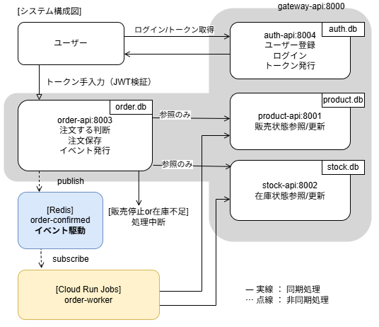
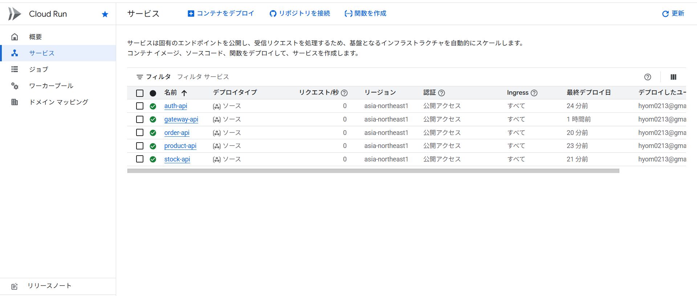
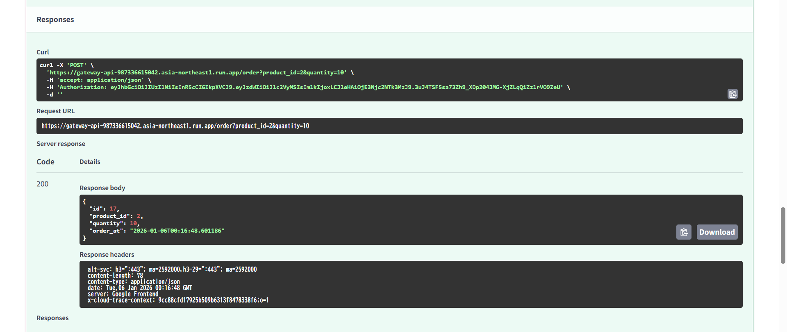
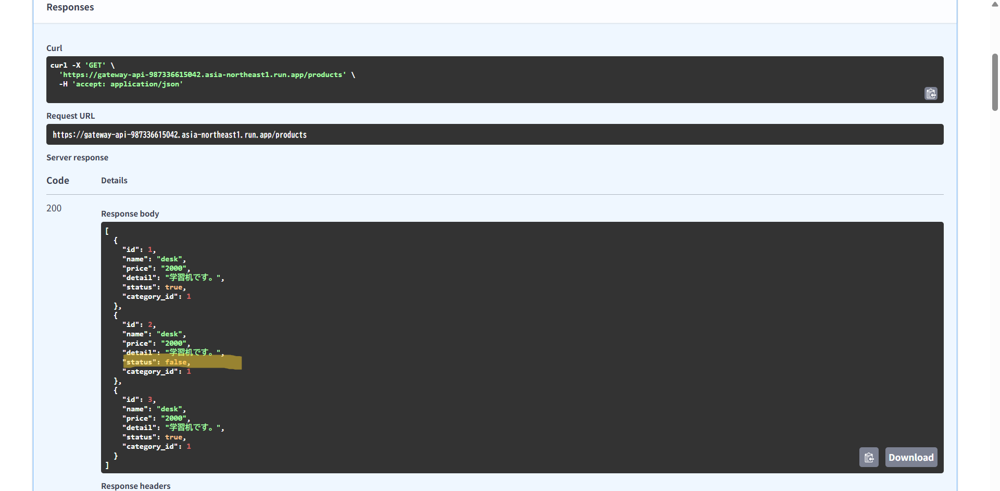

# 注文システム　マイクロサービス

FastAPIを使用したEcサイトの注文システムをマイクロサービス構成で実装しました。\
各サービスを疎結合に作成しており、非同期に連携させています。
注文確定時にイベントを発生させ、後続の処理をする仕組みをいれました。\
デモURL：[gateway-api](https://gateway-api-987336615042.asia-northeast1.run.app/docs)

## ブランチ構成

- main：ローカル開発・検証用
- deploy：デプロイ環境用（クラウド向け設定を含む）

## 目的

- マイクロサービスアーキテクチャの理解と実装
- サービス間通信（REST API）の実装
- イベント駆動での連携理解と実装
- 同期非同期通信の理解
- メッセージキューの導入

## アーキテクチャ

### GCP本番環境（Cloud Pub/Sub使用）

\
※ 注文確定後の非同期処理は Cloud Run Job として分離しています。\
本来は Pub/Sub → Job 実行のトリガーを介して動作する想定です。\
本ポートフォリオでは手動実行で挙動を確認しています。

### ローカル開発環境（Redis使用）



## 技術スタック

FastAPI\
SQLAlchemy（ORM）\
Alembic（マイグレーション）\
SQLite\
Pydantic（バリデーション）\
python-jose（JWT 認証）\
redis（メッセージキュー）\

## ファイル構成

```python
ec-microservice/
├── gateway-api/       # API Gateway
├── auth-api/          # 認証サービス
├── product-api/       # 商品管理サービス
├── stock-api/         # 在庫管理サービス
├── order-api/         # 注文サービス
├── requirements.txt   # 共通依存パッケージ
└── README.md          # このファイル
```

## 各サービスの役割

### Gateway API（ルーティング集約）

ポート: 8000

- ルーティング管理
- JWT認証の一元化

### Product API（商品管理サービス）

ポート: 8001
データベース: product.db

- 商品のCRUD操作
- カテゴリと商品の関連管理（外部キー制約）
- 商品IDによる商品検索

## Stock API（在庫管理サービス）

ポート: 8002
データベース: stock.db

- 商品ごとの在庫数管理
- 在庫の照会・更新・削除
- 商品IDによる在庫検索

## Order API（注文サービス）

ポート: 8003
データベース: order.db

- 注文処理（他サービスと連携）
- 商品在庫確認 → 在庫減算 → 注文記録
- JWT認証による注文者識別

### Auth API（認証サービス）

ポート: 8004
データベース: user.db

- ユーザー登録（サインアップ）
- ログイン認証
- JWT トークン発行・検証

サービス間連携フロー:

1. JWT トークンから user_id を取得
2. Product API で商品存在確認
3. Stock API で在庫数確認
4. 注文をデータベースに記録
5. 注文確定イベントを発生させ、以下の処理を行う
　・stock.db在庫を減少
　・在庫数が0ならば、product.dbのstatusをfalseに変更

## GCPデプロイ（本番環境）

### デプロイ済みサービス(稼働中)

- gateway-api: Cloud Run(ルーティング集約): https://gateway-api-987336615042.asia-northeast1.run.app/docs
- auth-api: Cloud Run (JWT認証): https://auth-api-987336615042.asia-northeast1.run.app/docs
- product-api: Cloud Run (商品管理): https://product-api-987336615042.asia-northeast1.run.app/docs
- stock-api: Cloud Run (在庫管理): https://stock-api-987336615042.asia-northeast1.run.app/docs
- order-api: Cloud Run (注文処理): https://order-api-987336615042.asia-northeast1.run.app/docs
- order-worker: Cloud Run Jobs (イベント購読)
- メッセージキュー: Cloud Pub/Sub

#### Cloud Runコンソール画面



4つのサービスが正常にデプロイされている状態。

#### 動作確認画面





注文処理により在庫が減少し、在庫ゼロで自動的に販売中止となることを確認。

## イベント駆動の動作確認方法

### 1. **ユーザー登録とログイン**
- gateway-api/auth-api: ユーザー登録（例: username=testuser, password=test1234）
- gateway-api/auth-apiI: ログインしてJWTを取得
- JWTをAuthorizationヘッダーにセット（鍵マーク）

### 2. **商品と在庫を登録**
※あらかじめテストデータ挿入済み、各GETエンドポイントから確認
- Product API: 商品作成
- Stock API: 在庫登録（例: stock=5）

### 3. **注文を実行**
- Order API: `/order?product_id=1&quantity=5`

### 4. **自動処理を確認**
【デプロイ環境の場合】\
注文確定後の非同期処理は Cloud Run Job として分離しています。\
本来は Pub/Sub → Job 実行のトリガーを介して動作する想定です。\
本ポートフォリオでは手動実行で挙動を確認しています。

- Stock API: 在庫が5→0に減少
- Product API: 在庫が0になったら、statusがtrue→falseに変更（販売中止）
  
## デプロイ手順

### 1. 前提条件

- Google Cloud CLIインストール済み
- GCPプロジェクト作成済み
- 課金アカウント設定済み

### 2. 認証とプロジェクト設定

```bash
gcloud auth login
gcloud config set project [PROJECT_ID]
gcloud services enable run.googleapis.com
gcloud services enable artifactregistry.googleapis.com
gcloud services enable pubsub.googleapis.com
```

### 3. Pub/Subセットアップ

```bash
gcloud pubsub topics create order-confirmed
gcloud pubsub subscriptions create order-confirmed-sub --topic=order-confirmed
```

### 4. 各サービスのデプロイ

```bash
# デプロイ用ブランチに切り替え
git checkout feature/add-gcp-deployment

```bash
# Auth API
cd auth-api
gcloud run deploy auth-api --source . --region asia-northeast1 --allow-unauthenticated --set-env-vars ALGORITHM=HS256 --set-env-vars SECRET_KEY='your_secret_key'

# Product API
cd ../product-api
gcloud run deploy product-api --source . --region asia-northeast1 --allow-unauthenticated

# Stock API
cd ../stock-api
gcloud run deploy stock-api --source . --region asia-northeast1 --allow-unauthenticated

# Order API
cd ../order-api
gcloud run deploy order-api --source . --region asia-northeast1 --allow-unauthenticated --set-env-vars ALGORITHM=HS256 --set-env-vars SECRET_KEY='your_secret_key'

# Gateway API
cd ../gateway-api
gcloud run deploy gateway-api --source . --region asia-northeast1 --allow-unauthenticated

```

### 5. order-workerのデプロイ

```bash
cd order_worker
gcloud builds submit --tag gcr.io/[PROJECT_ID]/order-worker
gcloud run jobs create order-worker --image gcr.io/[PROJECT_ID]/order-worker --region asia-northeast1 --execute-now
```

### GCP環境（デプロイ後）

デプロイ後のURLは以下のコマンドで確認できます。\
各サービスのSwagger UIへは各URLに`/docs`を付けてアクセスしてください。

```bash
# URL一覧確認
gcloud run services list --region asia-northeast1
```

API Gatewayでは、単一エントリーポイントで全てのAPIにアクセスできます。

```bash
# API Gateway
https://gateway-api-[PROJECT_ID].asia-northeast1.run.app/docs

```

## セットアップ(ローカル開発環境)

### 1. 依存パッケージのインストール

```bash
pip install -r ../requirements.txt

```

### 2. Redisの起動

```bash
# Dockerを使用
docker run -d -p 6379:6379 --name redis redis:latest

# 起動確認
docker ps
```

### 3. 各サービスのデータベースセットアップ

```bash
# Auth API
cd auth-api
alembic upgrade head

# Product API
cd ../product-api
alembic upgrade head

# Stock API
cd ../stock-api
alembic upgrade head

# Order API
cd ../order-api
alembic upgrade head
```

### 実行方法

各サービスを別々のターミナルで起動してください。

```bash

# ターミナル1: Product API
cd product-api
python main.py
# → http://localhost:8001

# ターミナル2: Stock API
cd stock-api
python main.py
# → http://localhost:8002

# ターミナル3: Order API
cd order-api
python main.py
# → http://localhost:8003

# ターミナル4: Auth API
cd auth-api
python main.py
# → http://localhost:8004

# ターミナル5: Gateway API
cd gateway-api
python uvicorn main:app
# → http://localhost:8000

# ターミナル5: イベント購読（order-worker）
cd order_worker
python event_listener.py
# → イベント購読開始
```

各サービスは自動生成されるSwagger UIでAPIを確認できます。

- Product API: <http://localhost:8001/docs>
- Stock API: <http://localhost:8002/docs>
- Order API: <http://localhost:8003/docs>
- Auth API: <http://localhost:8004/docs>
- Gateway API: <http://localhost:8000/docs>

## 工夫した点・学んだこと

- 非同期通信を利用することでレスポンス速度を向上させた
- 実務を想定して過度に複雑な構成にするのではなく、基本的なイベント発生と購読の流れを明確に理解することを重視した
- 在庫整合性を同期的に保証するのではなく、可用性を優先し、在庫は最終的に整合する前提で設計した

## 改善点・今後の課題

- [x] API Gateway導入
- [ ]監視・ログ集約
- [ ]CI/CD自動化